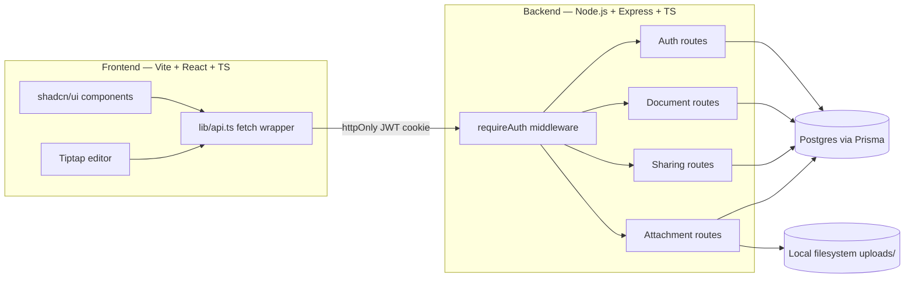
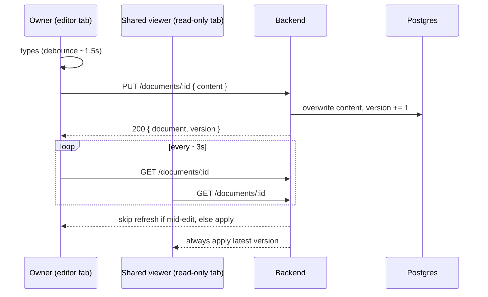
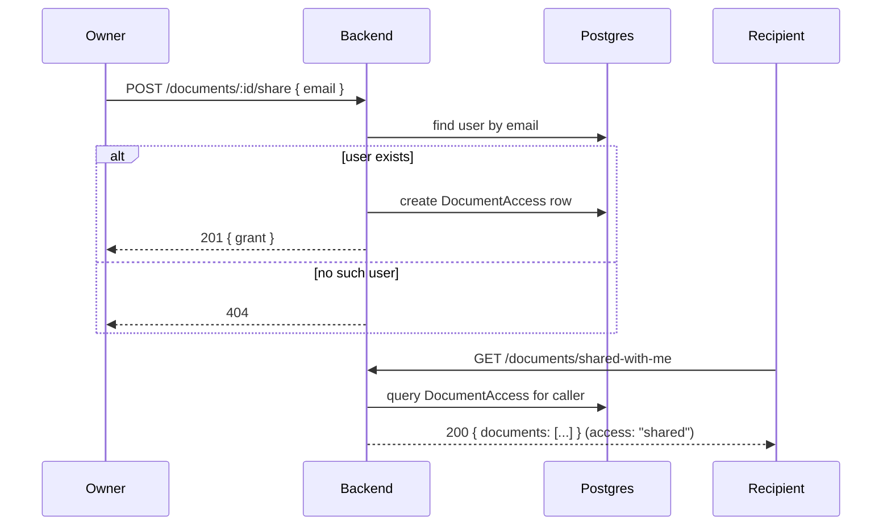
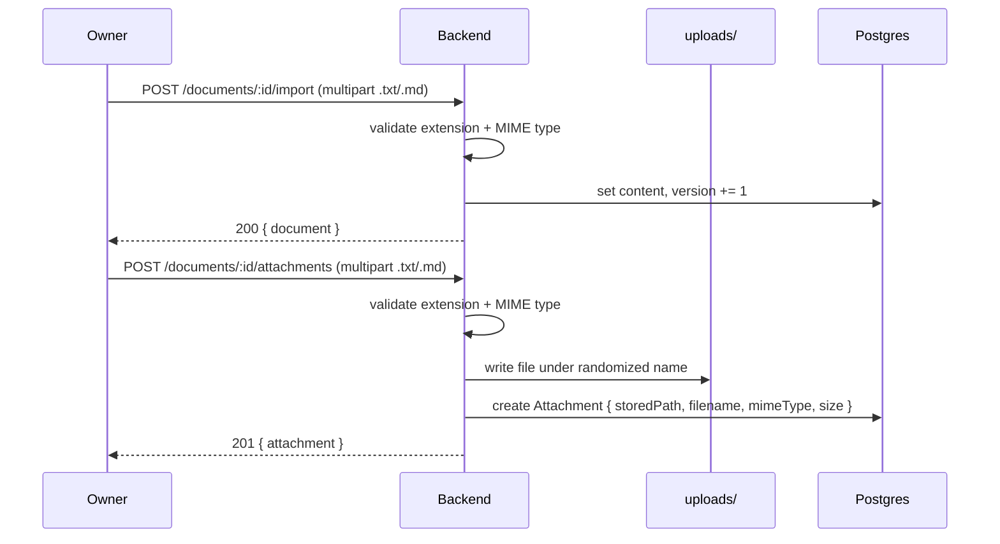

# Architecture

The decided architecture for the scoped build. See [docs/PRD.md](PRD.md) for why, [docs/adr/](adr/)
for the reasoning behind each cut, and [docs/specs/](specs/) for the exact contracts. This doc is
the "how it fits together" view.

## System overview

## Components

- **Frontend** — Vite + React + TypeScript SPA. shadcn/ui + Tailwind for components
  ([docs/ui-tokens.md](ui-tokens.md), [docs/ui-rules.md](ui-rules.md)); Tiptap (free/open-source
  packages only) for rich text editing. Talks to the backend exclusively through
  `src/lib/api.ts`, a thin `fetch` wrapper sending `credentials: 'include'` so the session cookie
  rides along automatically.
- **Backend** — Node.js + Express + TypeScript, organized as route modules (`auth`, `documents`,
  `sharing`, `attachments`) behind a single `requireAuth` middleware. Every route requires a
  session — there is no anonymous/public access (ADR-0002).
- **Database** — Postgres, accessed via Prisma. System of record for users, documents, access
  grants, and attachment metadata (ADR-0004). Schema: [docs/specs/data-model.md](specs/data-model.md).
- **File storage** — local filesystem (`uploads/`), storing only `.txt`/`.md` files with
  server-generated names; Postgres holds the metadata pointer (ADR-0004).

## Key architectural decisions

| Decision                                                                                 | ADR                                                    |
| ---------------------------------------------------------------------------------------- | ------------------------------------------------------ |
| Polling (~3s) + version counter, not WebSockets/CRDT                                     | [0001](adr/0001-polling-over-realtime-sync.md)         |
| Binary owner/viewer permission via explicit `DocumentAccess` grants, not anonymous links | [0002](adr/0002-binary-owner-viewer-permissions.md)    |
| ~~Single document per user~~ — superseded                                                | [0003](adr/0003-single-document-per-user.md)           |
| Postgres/Prisma persistence, local disk for attachments                                  | [0004](adr/0004-postgres-prisma-local-disk-storage.md) |
| Users can own multiple documents (minimal list, no dashboard)                            | [0005](adr/0005-multiple-owned-documents.md)           |

## Request flows

### Edit → autosave → poll (ADR-0001)

### Sharing (ADR-0002)

### File import vs. attach (ADR-0004)

## Security notes

- Passwords hashed with bcrypt; session is a JWT in an httpOnly cookie — never exposed to
  client-side JS, mitigating XSS token theft.
- Every document/attachment route checks the caller is the owner or has a `DocumentAccess` grant
  before returning data — no security-by-obscurity via unguessable IDs.
- Uploaded file validation checks both extension and MIME type; stored filenames are
  server-generated (never derived from user input) to prevent path traversal.
- No anonymous/public routes exist in this build (see ADR-0002) — every request is authenticated.

## Explicitly deferred

Real-time concurrent editing, granular per-user roles, full document dashboard (rename/delete/
search), cloud storage, deployment config, and conflict-resolution UI — see
[docs/PRD.md](PRD.md#out-of-scope-for-this-pass-candidate-follow-ups) for the complete list.
